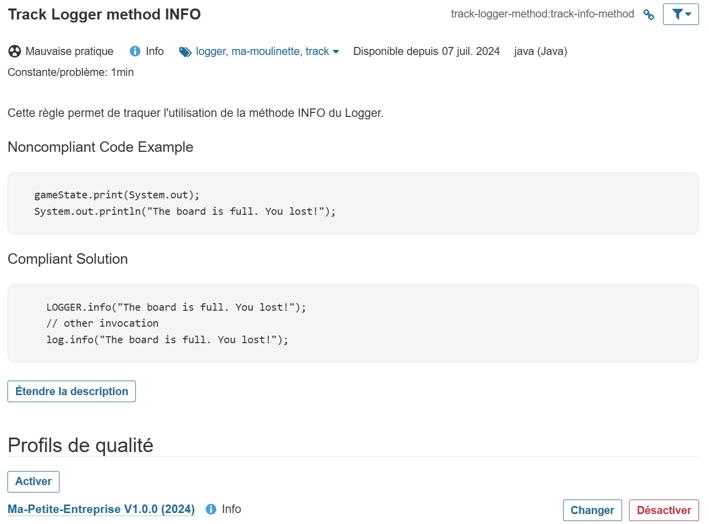

# SonarQube Java Custom Rules Plugin

----

## Introduction

`Track Logger Method` est une extension pour SonarQube. Il vient ajouter une règle Java pour identifier la nature du Logger et la méthode employée dans la code.

Cette extension est utilisée dans le cadre du projet **Ma-Moulinette** pour identifier le nombre de logger de type `info`, `error`, `warn` et `debug`.

### Changelog Version 1.1.0-Release

Dans cette version  :

* chaque méthode a fait l'objet d'une règle.
* une classe abstraite a été ajouté pour éviter de dupliquer le code.
* pour chaque issue, un message est affiché.
* Code Clean et corrections SonarQube.
* mise à jour des dépendances du pom.xml.
* correction de la remonté des infos jacoco dans SonarQube.
* mise à jour de la documentation.

### Changelog Version 1.0.0-Release

Dans cette première version :

* une seule règle a été ajoutée pour détecter les méthodes, `info`, `error`, `warn` et `debug`.
* une issue est affichée avec le contenu suivant : `Utilisation de la méthode : {method}`.

### Licence

Ce projet est basé sur le projet **custom Rules** pour SonarJava de la société SonarSource.

Lien : <https://github.com/SonarSource/sonar-java/blob/master/docs/CUSTOM_RULES_101.md>

The [GNU LGPL 3.0](https://www.gnu.org/licenses/lgpl.txt) license of this GitHub repository does not apply in the `java-custom-rules-example` directory.
All contents under the `java-custom-rules-example` directory are licensed under the more permissive [MIT No Attribution](LICENSE.txt) license.

## Notes personnelles

Je ne suis pas développeur Java et le développement de ce plugin a été un défi personnel. J'ai même à plusieurs reprise été tenté d'abandonner tant les difficultés étaient nombreuses. Après trois jours de travail et de nombreuses tentatives, j'ai compris comment utiliser le projet template `CUSTOM_RULES_101`.

Le système de gestion des extensions pour SonarQube n'est pas pratique. Je comprends pourquoi de nombreux développeurs ne maintiennent plus leur extension.

En cause :

* une documentation parfois sommaire et/ou accessible que pour un public expert ;
* une forte adhérence avec la version de SonarQube (api) et à l'extension utilisée ;

En conséquence, il se peut que la version de cette extension ne ce compile pas et qu'il faille modifier le code pour corriger les problèmes de dépendances.

## Version supportée

Cette extension est compatible uniquement avec la version SonarQube 8.9 LTS et 9.9 LTS.

Lien SQ 8.9 LTS : <https://www.sonarsource.com/products/sonarqube/downloads/lts/8-9-lts/>
Lien SQ 9.9 LTS : <https://www.sonarsource.com/products/sonarqube/downloads/lts/9-9-lts/>

## Prérequis

L’extension nécessite les éléments suivants :

* [x] une version du JDK 11 pour développer et compiler ;
* [x] une version de l'API sonar compatible avec la version de SonarQube ;
* [x] La version du plugin sonarJava ;

### version de SonarQube

Cette propriété définie la version de votre version SonarQube.

```xml
<sonarqube.version>9.9.4.87374</sonarqube.version>
```

Par exemple pour la version 9.9 LTS :

| Date       | version     |
|------------|-------------|
| 03/02/2023 | 9.9.0.65466 |
| 27/94/2023 | 9.9.1.69595 |
| 25/08/2023 | 9.9.2.77730 |
| 09/11/2023 | 9.9.3.79811 |
| 20/02/2024 | 9.9.4.87374 |
| 25/04/2024 | 9.9.5.90363 |
| 17/06/2024 | 9.9.6.92038 |

Données SonarSource : <https://github.com/SonarSource/sonarqube/releases>

Pour la version 8.9 LTS la dernière version est **8.9.10.61524** du **21/10/2022**.

### Version de L'API Sonar Plugin

Cette dépendance fournie les méthodes nécessaires pour le développement d'une extension. Elle dépend là aussi de la version de SonarQube.

```xml
<sonar.plugin.api.version>9.17.0.587</sonar.plugin.api.version>
```

Lien : <https://github.com/SonarSource/sonar-plugin-api>

Pour la version 9 uniquement :

| SonarQube   | Plugin API |
|-------------|------------|
|             | 9.17.0.587 |
|             | 9.16.0.560 |
|             | 9.15.0.435 |
| 9.9.0.65466 | 9.14.0.375 |
| 9.8.0.63668 | 9.13.0.360 |
| 9.7.1.62043 | 9.11.0.290 |
| 9.7.0.61563 | 9.11.0.290 |
| 9.6.1.59531 | 9.9.0.229  |
| 9.6.0.59041 | 9.9.0.229  |
| 9.5.0.56709 | 9.6.1.114  |

`Note` : Pour la version **9.9 LTS**, il faudra au minimum la version **9.14.0.375**.

### Version de l'extension Java

Pour que l'extension **Track-Logger-Method**, il est nécessaire de déclarer la version de l'extension Java fournie par l'application SonarQube.

Pour la version 9.9.4, la version de l'extension Java est 7.16.0.30901.

```xml
<sonarjava.version>7.16.0.30901</sonarjava.version>
```

L'extension est présente dans le dossier **lib/extension** de l'application SonarQube

## Tests Unitaires

Avant de lancer la compilation du projet, il convient, comme le recommande SonarSource, de lancer les tests unitaires pour vérifier que l'extension fonctionne correctement.

Il faudra lancer cette commande depuis un terminal :

```bash
mvn test
```

Si tout va bien, vous devriez avoir ces résultats :

```plaintext
[INFO] Results:
[INFO]
[INFO] Tests run: 4, Failures: 0, Errors: 0, Skipped: 0
[INFO]
[INFO] ------------------------------------------------------------------------
[INFO] BUILD SUCCESS
[INFO] ------------------------------------------------------------------------
[INFO] Total time:  7.401 s
[INFO] Finished at: 2024-07-07T10:12:10+02:00
[INFO] ------------------------------------------------------------------------
```

## Compilation

Pour lancer la compilation et construire l'extension `jar`, il conviendra de lancer cette commande :

```bash
mvn clean install
```

Et voila :)

```plaintext
[INFO] ------------------------------------------------------------------------
[INFO] BUILD SUCCESS
[INFO] ------------------------------------------------------------------------
[INFO] Total time:  8.547 s
[INFO] Finished at: 2024-07-07T10:15:16+02:00
[INFO] ------------------------------------------------------------------------
```

## Déploiement

Il conviendra de copier l'extension `tracker-logger-method-xxx.jar` dans le dossier `/extensions/plugins/` de votre serveur SonarQube. Par exemple pour la version 1.0.0, l'extension est : `track-logger-method-1.0.0-RELEASE`.

En suite, démarrer ou redémarrer le serveur SonarQube afin que l'extension soit prise en compte.

```plaintext
2024.07.07 10:42:11 INFO  app[][o.s.a.SchedulerImpl] Process[ce] is up
2024.07.07 10:42:11 INFO  app[][o.s.a.SchedulerImpl] SonarQube is operational
```

> Erreur : Plugin Java Custom Rules [javacustom] is ignored.

```plaintext
Plugin Java Custom Rules [javacustom] is ignored because the version 7.28.0.33738 of required plugin [java] is not installed
```

La version du plugin `sonar-java-plugin` déclarée dans le `pom.xml` ne correspond pas à la version présente dans votre version de SonarQube.

> Erreur : Erreur Plugin Key is missing from manifest.

```plaintext
2024.07.09 08:29:47 ERROR web[][o.s.s.p.PlatformImpl] Web server startup failed
org.springframework.beans.factory.BeanCreationException: Error creating bean with name 'jdk.internal.loader.ClassLoaders$AppClassLoader@659e0bfd-org.sonar.server.plugins.ServerPluginManager': Initialization of bean failed; nested exception is java.lang.NullPointerException: Plugin key is missing from manifest
```

Le fichier `pom.xml` utilise le plugin `sonar-packaging-maven-plugin` pour générer le manifest nécessaire au dépliement du jar. Au moment de la compilation, les informations suivantes doivent être affichées.

```plaintext
 --- sonar-packaging-maven-plugin:1.23.0.740:sonar-plugin (default-sonar-plugin) @ track-logger-method ---
[INFO] -------------------------------------------------------
[INFO] Plugin definition in update center
[INFO]     Key: trackloggermethod
[INFO]     Name: Track Logger Method
[INFO]     Description: Track logger method for java
[INFO]     Version: 1.1.0-RELEASE
[INFO]     Display Version: 1.1.0-RELEASE
[INFO]     Entry-point Class: fr.ma.moulinette.java.MyJavaRulesPlugin
[INFO]     Required Plugins: java:7.16.0.30901
[INFO]     Does the plugin support SonarLint?: false
[INFO]     Use Child-first ClassLoader: false
[INFO]     Base Plugin:
[INFO]     Homepage URL: https://github.com/Laurent-hadjadj/track-logger-method.git
[INFO]     Minimal Sonar Plugin API Version: 9.14.0.375
[INFO]     Licensing: CC-BY-NC-SA 4.0
[INFO]     Organization:
[INFO]     Organization URL:
[INFO]     Terms and Conditions:
[INFO]     Issue Tracker URL: https://github.com/laurent-hadjadj/track-logger-method/issues
[INFO]     Build date: 2024-07-09T07:12:35+0000
[INFO]     Sources URL: https://github.com/Laurent-hadjadj/track-logger-method
[INFO]     Developers:
[INFO]     Minimal JRE Specification Version: 11
[INFO]     Minimal Node.js Version:
[INFO]     Languages for which this plugin should be downloaded: java
[INFO] Skip packaging of dependencies
[INFO] -------------------------------------------------------
```

Et voila :)

```plaintext
2024.07.07 10:41:51 INFO  web[][o.s.s.p.ServerPluginManager] Deploy Track Logger Method / 1.0.0-RELEASE / null
```

## Utilisation

L'extension est disponible dans le magasin des extensions SonarQube :

> **Version 1.0.0**


> **Version 1.1.0**


La règle est présente dans le référentiel des règles Java :
> **Version 1.0.0**


> **Version 1.1.0**


La règle a été ajoutée au profil Java Actif.

> **Version 1.0.0**



> **Version 1.1.0**


Pour lancer une analyse d'un projet maven, il suffira de lancer la commande suivante :

```bash
mvn sonar:sonar
```

Lors de l'analyse une trace est affiché dans la console.

```plaintext
[INFO] ------------------------------------------------------------------------
[INFO] BUILD SUCCESS
[INFO] ------------------------------------------------------------------------
[INFO] Total time:  19.351 s
[INFO] Finished at: 2024-07-07T11:10:30+02:00
[INFO] ------------------------------------------------------------------------
```

Par exemple pour le projet `track-logger-method` :

> **Version 1.0.0**


> **Version 1.1.0**


On retrouve bien dans les mauvaise pratique les deux "LOGGER" présents dans l’application :


## Récupération des métriques

Depuis d'application Ma-Moulinette, il est possible d'obtenir le nombre de fois qu'un Logger est utilisé en fonction de sa méthode (info, warn, error ou debug).

La requête utilisée est la suivante :

```plaintext
GET: api/issues/search?componentKeys=<fr.ma.moulinette:track-logger-method>&rules=<track-logger-method:track-logger-method>&facets=rules&statuses=OPEN
```

Avec :

* [x] **componentKeys** : la clé unique du projet ;
$ [x] **rules** : la règle que l'on recherche ;
* [x] **facets** : le filtre de consolidation des données ;
* [ ] **statuses** : le status de issue.

Pour remonter uniquement les Logger avec une méthode (info, warn, error, debug), il suffit de définir le `statuses` à `OPEN`.
